# Static Program Analysis - Data Flow Analysis - Applications

> 数据流分析是静态分析是非常重要的

## Overview of Data Flow Analysis

```html
Data Flow Analysis
👇
How Data Flow on CFG?
👇
How application-specific Data Flows through the Nodes (BBs/statements) and Edges (control flows) of CFG (a program)?
👇
1. application-specific Data 对数据进行 Abstraction 例如 +, -, 0, unknown, undefined
2. Flows 静态分析中所有可能的结果都需要考虑进去，进行 Over-approximation 或者 在某些特殊情况下进行 Must-approximation 此处更改为：Safe-approximation
- may analysis: safe=over
- must analysis: safe=under 
3. 近似的两个关键点
- Nodes: Transfer function 例如 + op - = -; + op + = +
- Edges: Control-flow handling 例如 union the signs at merges
```

**Over-approximation** 是绝大多数静态分析中需要考虑的内容，属于 *may analysis*

- **may analysis:** outputs information that may be true (over-approximation)
- **must analysis:** outputs information that must be true (under-approximation)
- Over- and under-approximations are **both for safety of analysis**

> different **data-flow analysis applications** have
> different data abstraction and 
> different flow safe-approximation strategies, i.e., 
> different transfer functions and control-flow handlings

## Preliminaries of Data Flow Analysis

> 为了后续更加简便的交流

### Input and Output States 

- Each execution of an IR statement transforms an *input state* to a new *output state*
- The input (output) state is associated with the *program point* before (after) the statement.
- 程序主要存在几种可能的执行顺序
  - 顺序执行 IN[s2] = OUT[s1]
  - 分叉执行 IN[s2] = IN[s3] = OUT[s1]
  - 汇聚执行 IN[s2] = OUT[s1] ^ OUT[s3]  
    - 需要对来自两个来源的数据进行处理，处理的方法是 meet operation

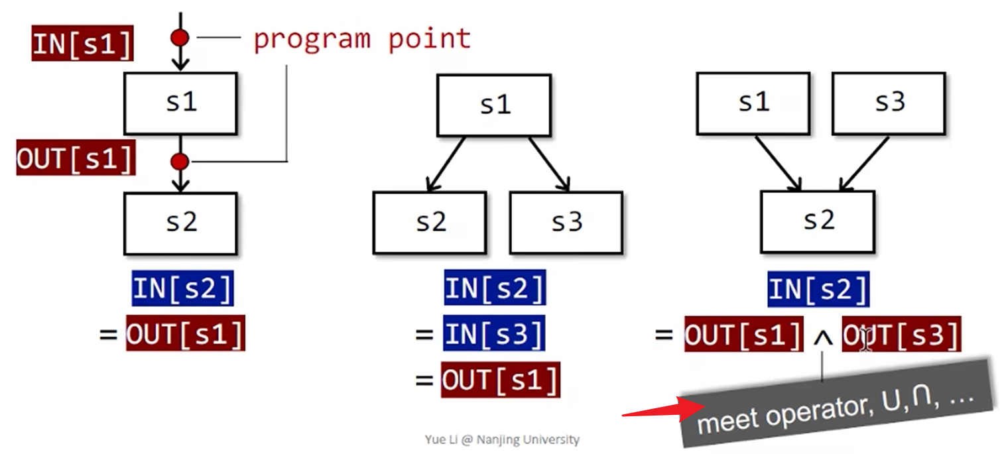

In each data-flow analysis application, we associate with every program point a *data-flow value* that represents an *abstraction* of the set of all possible *program states* that can be observed for that point.

```java
// 🔴 代表当前的 program states  把数据信息进行抽象，形成 data-flow values
x = 10; 
🔴 👉 x = +, y = ⊥
y = -1;
🔴 👉 x = +, y = -
x = y;
🔴 👉 x = -, y = -
x = x / y;
🔴 👉 x = +, y = -
```

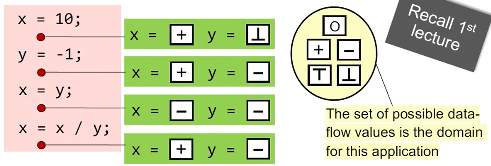

Data-flow analysis is to **find a solution** to a set of *safe-approximation-directed constraints* on the IN[s]' and OUT[s]'s, for *all statements*.
- *constraints* based on semantics of statements (*transfer functions*)
- *constraints* based on the *flows of control*

### Notations for Transfer Function's Constraints 

**Forward Analysis** $OUT[s] = f_s(IN[s])$

**Backward Analysis** $IN[s] = f_s(OUT[s])$

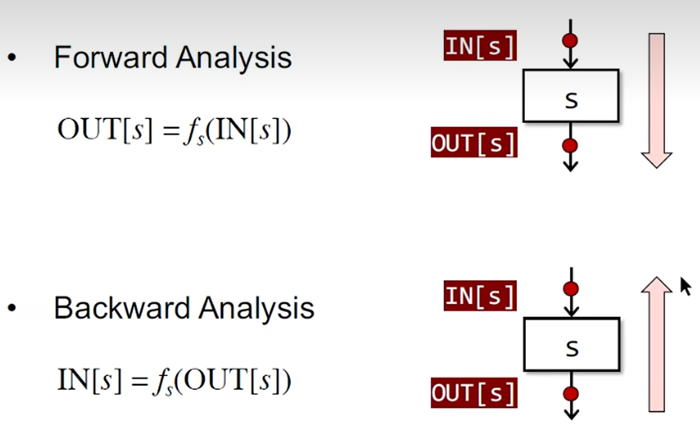

### Notations for Control Flow's Constraints 

**Control flow within a BB**

$IN[S_{i+1}] = OUT[S_i], for all i = 1, 2, ..., n-1$

**Control flow among BBs**

$IN[B] = IN[S_1]$

$OUT[B] = OUT[S_n]$

*Forward Analysis*

注意先执行 $f_{S_1}$

$OUT[B] = f_B(IN[B]), f_B=f_{S_n} · ... · f_{S_2} · f_{S_1}$

$IN[B] = ∧_{P\_a\_predecessor\_of\_B} OUT[P]$

> The meet operator ∧ is used to summarize the contributions from different paths at the confluence of those paths 

*Backward Analysis*

注意先执行 $f_{S_n}$

$IN[B] = f_B(OUT[B]), f_B=f_{S_1} · ... · f_{S_{n-1}} · f_{S_n}$

$OUT[B] = ∧_{S\_a\_successor\_of\_B} IN[S]$

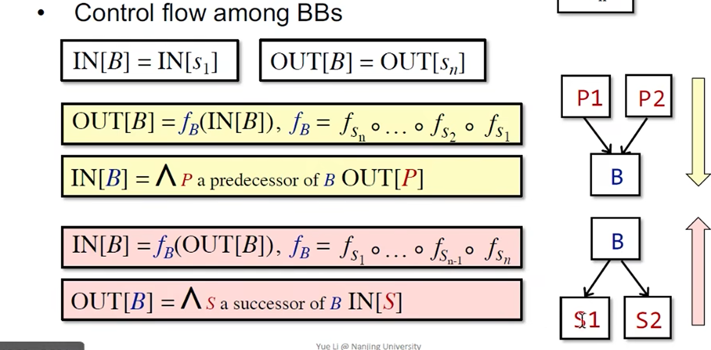

## Data Flow Analysis Applications 

> 此处不包括对于 `Method Calls` 和 `Aliases` 的问题

### Reaching Definitions Analysis

> 编译优化 和 简单的错误检测都可以使用

A **definition d** at program point p *reaches* a point q if there is a path from p to q such that **d** is not 'killed' along that path.

- A **definition of a variable** v is statement that assigns a value to v
- Translated as: definition of variable v at program point p reaches point q if there is a path from p to q such that no new definition of v appears on that path 
  - 即没有新的声明的产生


**一个应用的例子**

Reaching definitions can be used to **detect possible undefined variables**. e.g., introduce a dummy definition for each variable v at the entry of CFG, and if the dummy definition of v reaches a point p where v is used, then v may be used before definition (as *undefined* reaches v). 这是一个 **may analysis**

#### Understanding Reaching Definitions

Data Flow Values/Facts

**Abstraction**

- The definitions of all the variables in a program
- Can be represented by bit vectors
  - e.g., D1, D2, D3, D4, ..., D100 (100 definitions) 对应 100 个 bits 
    - Bit i from the left represents definition Di

**Safe-approximation**

**D:** v = x op y 

This statement "generates" a definition D of variable v and **"kills" all the other definitions** in the program that define variable v, while leaving the remaining incoming definitions unaffected.

*Transfer Function:* $OUT[B] = gen_B ∪ (IN[B] - kill_B)$

例子：

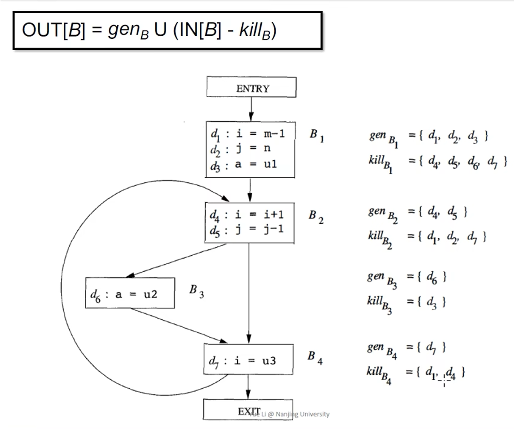

*Control Flow:*

Forward Analysis: $IN[B] = ∪_{P a\_predecessor\_ of\_B} OUT[P]$ 根据上述的分析需求，这应该是一个 Forward Analysis

> A definition reaches a program point as long as there exists at least one path along which the definition reaches.

#### Algorithm of Reaching Definitions Analysis

**INPUT:** CFG ($kill_B$ and $gen_B$ computed for each basic block B)

**OUTPUT:** IN[B] and OUT[B] for each basic block B 

**METHOD:** 

```java
// 为什么初始化为空集？
// Answer: Entry 是虚拟入口，Entry是没有Definition和Statement，因此一定为空；可以认为是 boundary condition
OUT[entry] = ⌀;
// 为什么 entry 要被剔除？
// Answer: 在 may analysis 中，通常为空，而 must analysis 则通常为 ⊤，因此为了达到算法模板，此处分开赋值
for (each basic block B\entry)
    // 为什么 OUT[B] 要初始化为空集？
    // Answer: Basic Block 在 may analysis 中，通常为空，而 must analysis 则通常为 ⊤
    OUT[B] = ⌀;

// 为什么这里循环会停止？
// 当与上次的OUT不同，则是发生变化
// 根据后续的例子，可以发现当 OUT 不变时，
while (changes to any OUT occur)
    for (each basic block B\entry) {
        // Control Flow
        IN[B] = ⋃_{P a predecessor of B} OUT[P]
        // Transfer Function
        OUT[B] = gen_B ⋃ (IN[B] - kill_B)
    }
```

**例子：**

8 个 Definition，5 个 Basic Blocks

对应的真实程序

```java
D1
D2
do {
    D3
    D4
    if (...) {
        D5
        D6
    } else {
        D7
        break
    }
} while (...)
D8
```

**Definition 用 bit vector 表示。0代表不能到达，1代表能达到**

In each data-flow analysis application, we associate with every program point a **data-flow value** that represents an *abstraction* of the set of all possible **program states** that can be observed for that point.

Data-flow analysis is to **find a solution** to a set of *safe-approximation-directed constraints* on the IN[s]' and OUT[s]'s, for *all statements*.
- *constraints* based on semantics of statements (*transfer functions*) 
- *constraints* based on the *flows of control*  

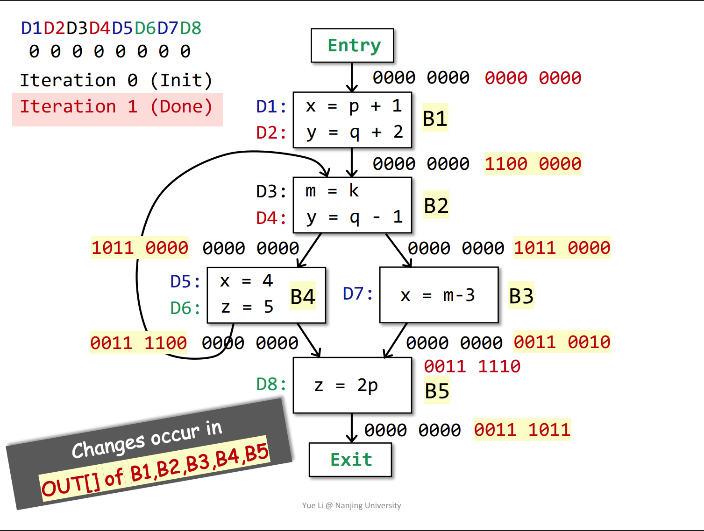

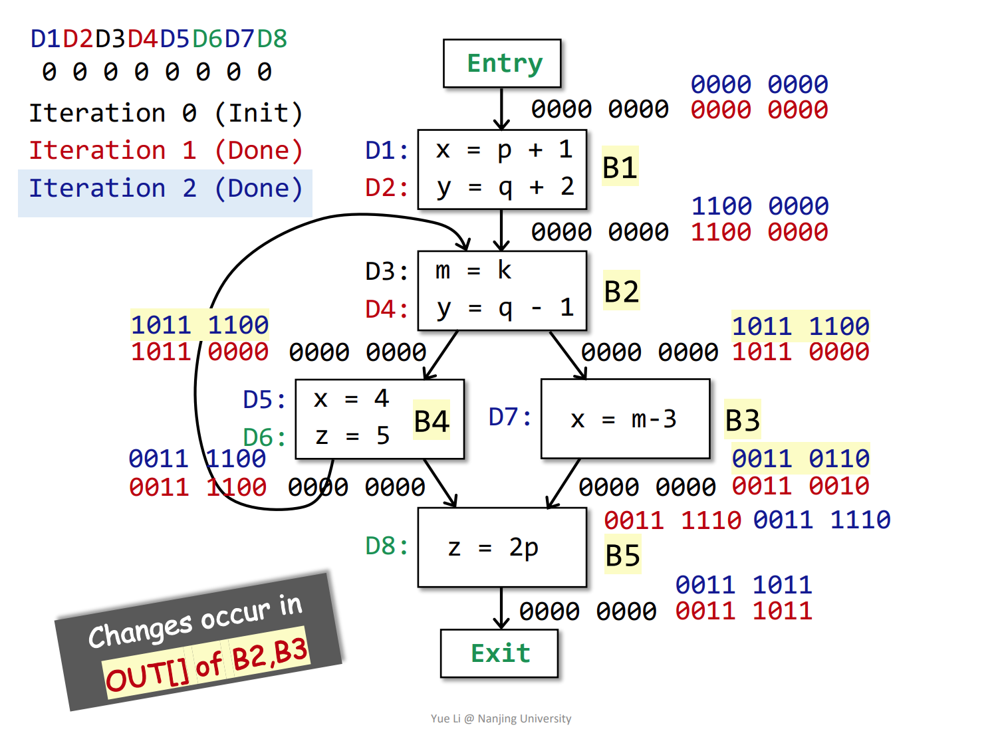

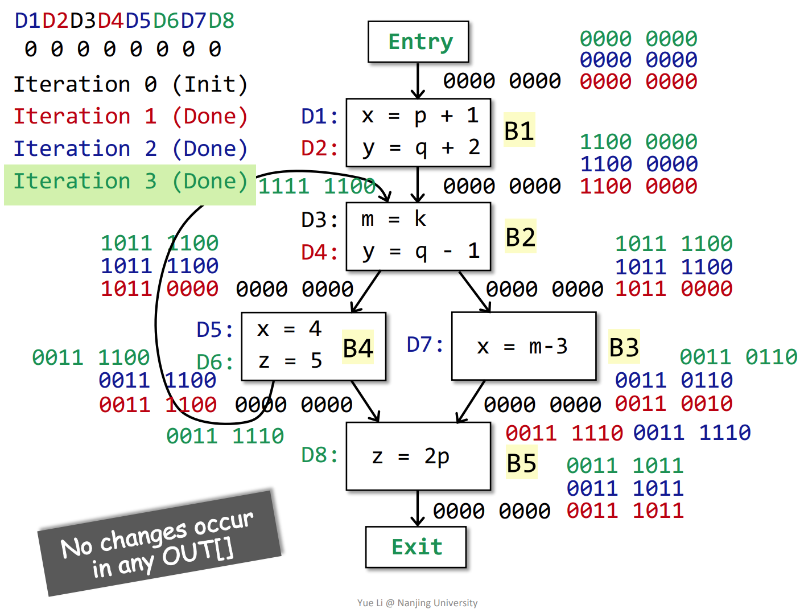 

> 对于 Reaching Definition 任务，当输入固定时，输出实际上一定是确定的
> 因此，最后一次不变的，就是 Final Result

**迭代最后为什么能停？**

```java
more facts
👇
OUT[S] = gen_S ⋃ (IN[S] - kill_S)
```


- $gen_S$ and $kill_S$ remain unchanged 这两者是不变化的
- When more facts flow in IN[S], the "more facts" either 
  - is killed, or 要么被 killed 
  - flows to OUT[S] ($survivor_S$) 存活的内容会变成 OUT，那么就会一直停留在这里
- When a fact is addd to OUT[S], through either $gen_S$, or $survivor_S$, **it stays there forever**
- Thus OUT[S] never shrinks (e.g., 0→1, or 1→1) 因为是需要首先 kill 掉之前的，再增加新的，因此不可能 1→0
- As the set of facts is finite (e.g., all definitions in the program), there must exist a pass of iteration during which nothing is added to any OUT, and then the algorithm terminates

---

**Is it Safe to terminate by this condition?**

- IN[B] = ⋃_{P a predecessor of B} OUT[P]
  - IN' will not change if OUT's do not change
- OUT[B] = gen_B ⋃ (IN[B] - kill_B)
  - OUT's will not change if IN's do not change

- 此时算法到达了一个不动点 Reach a **fixed point**，也与单调性相关 Also related with monotonicity
- **只有一个不动点吗？单调性如何理解？**

### Live Variables Analysis

Live variables analysis tells whether the vaule of **variable v** at **program point p** could be used along some path in CFG starting at p.
If so, v is live at p; otherwise, v is dead at p.

- Information of live variables can be used for register allocations. e.g., at some point all registers are full and we need to use one, then we should favor using a register with a dead value.
- 在此处，需要注意 v 在此 Path 中应该不会被重新定义，才会被认为是 live 的

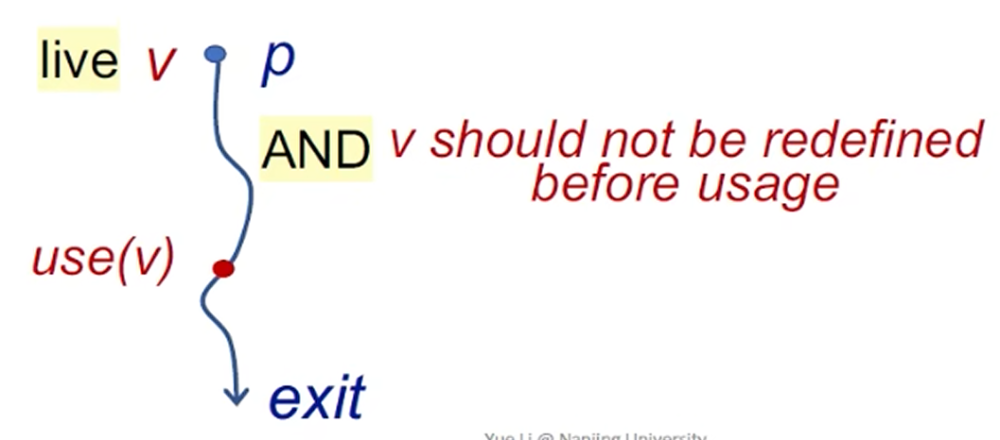

#### Understanding Live Variables Analysis

**Abstraction**

- Data Flow Values/Facts 
  - All the variables in a program
  - Can be represented by bit vectors 
    - e.g., V1, V2, V3, V4, ..., V100 (100variables)  
    - Bit i from the left represents variable Vi

**Safe-approximation**

<u>应该使用 Forward 还是 Backward?</u> 应该用 backward，原因是 可以直接从 use 的地方向前去找，而不用从头开始找到最后才看到

<u>应该使用 may analysis，即只需要有一条使用则认为有 use 的情况</u>

OUT[B] = ⋃_{S a successor of B} IN[S]

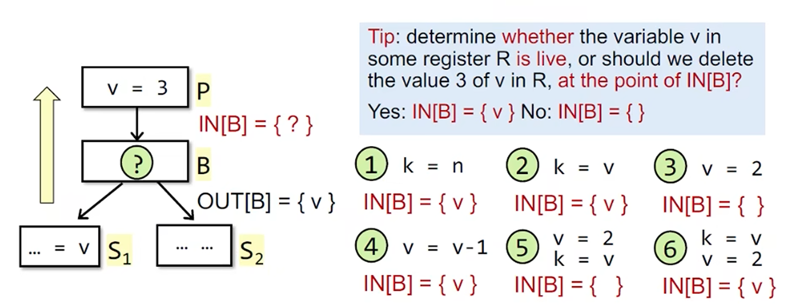

**Tip:** determine whether the variable v in some register R is live, or should we delete the value 3 of v in R, at the point of IN[B]?  **Yes:** IN[B] = {v}; **No:** IN[B] = {}

1. k = n        👉 IN[B] = {v} 因为在后续 `...=v` 使用到了，而且 v 没有被重新定义
2. k = v        👉 IN[B] = {v} 没有什么疑问，也是 v
3. v = 2        👉 IN[B] = { } 因为涉及重新定义，因此此处为 空
4. v = v - 1    👉 IN[B] = {v} 在 re-define 之前使用，因此为 v
5. v = 2; k = v 👉 IN[B] = { } 先 re-define 后使用，因此为 空
6. k = v; v = 2 👉 IN[B] = {v} 在 re-define 之前使用，因此为 v

*Transfer Functions:* $IN[B] = use_B ∪ (OUT[B] - def_B)$

> 一般都是减去一部分再union删除的

- $def_B$: It is redefined in B
- $OUT[B] - def_B$: It is live coming out of B and is not re-defined in B
- $use_B$: It is used before re-definition in B

#### Algorithm of Live Variables Analysis

**INPUT:** CFG ($def_B$ and $use_B$ computed for each basic block B)

**OUTPUT:** IN[B] and OUT[B] for each basic block B 

**METHOD:** 

```java
// boundary 初始化
IN[exit] = ⌀;

for (each basic block B\exit)
    // 一般情况下，may analysis 是 空， must analysis 是 111111... 全集
    IN[B] = ⌀;

while (changes to any IN occur)
    for (each basic block B\exit) {
        // Control Flow
        OUT[B] = ⋃_{S a successor of B} IN[S]
        // Transfer Function
        IN[B] = use_B ∪ (OUT[B] - def_B)
    }
```

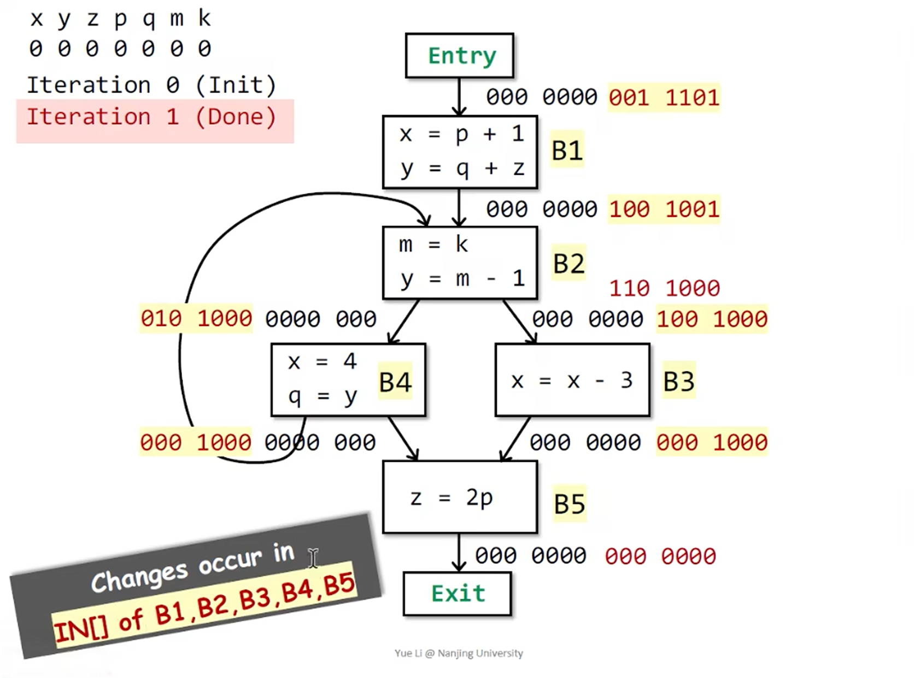


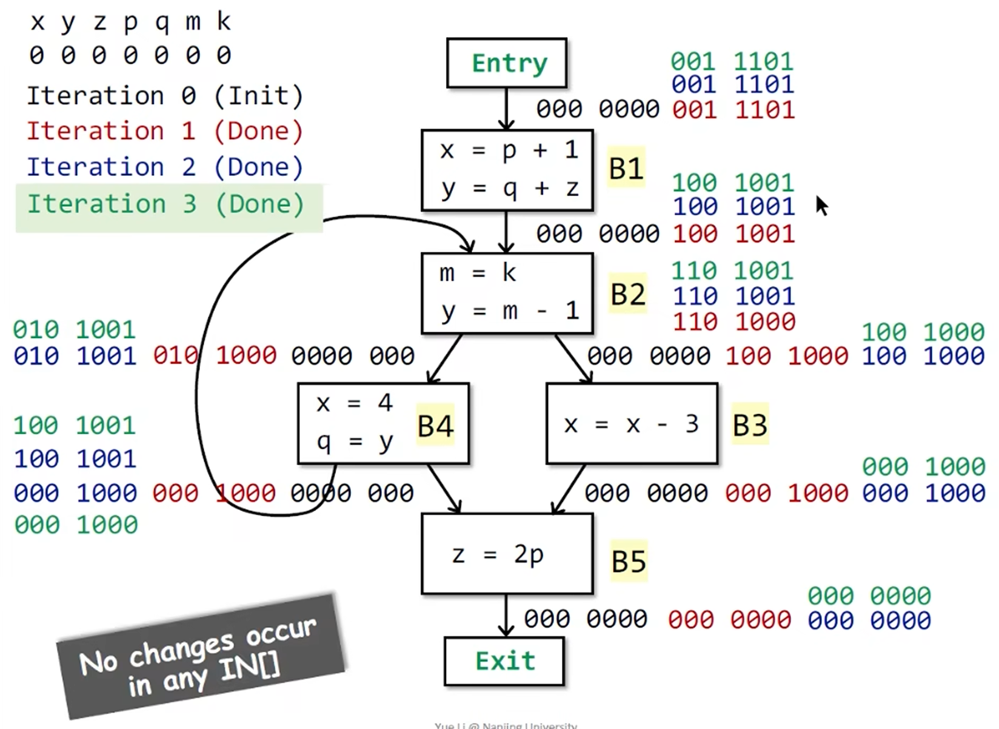

### Available Expressions Analysis

An expression `x op y` is **available** at program point if (1) **all** paths from the entry to p **must** pass through the evaluation of `x op y`, and (2) after the last evaluation of `x op y`, there is no redefinition of x or y.

- This definition means at program p, we can replace expression `x op y` by the result of its last evaluation.
- The information of available expressions can be used for detecting global common subexpressions.

#### Understanding Available Expressions Analysis

**Abstraction**

Data Flow Values/Facts:

- All the expressions in a program 
- Can be represented by bit vectors 
  - e.g., E1, E2, E3, E4, ..., E100 (100 expressions)
  - Bit i from the left represents expression Ei

**Safe-approximation**

```java
IN = {a + b}
↓
a = x op y
↓
OUT = {x op y}
```

- Add to OUT the expression `x op y` (**gen**)
- Delete from IN any expression involving variable `a` (**kill**)

*Transfer Functions:* $OUT[B] = gen_B ⋃ (IN[B] - kill_B)$

IN[B] = ⋂ _ {P a predecessor of B} OUT[P]

- 此处使用交集：All paths from entry to point p must pass through the evaluation of `x op y`
- For safety of the analysis, it may report an expression as unavailable even if it is truly available 
  - (must analysis → under-approximation)
  - 例如：宁愿允许漏报，也不允许出错
  - 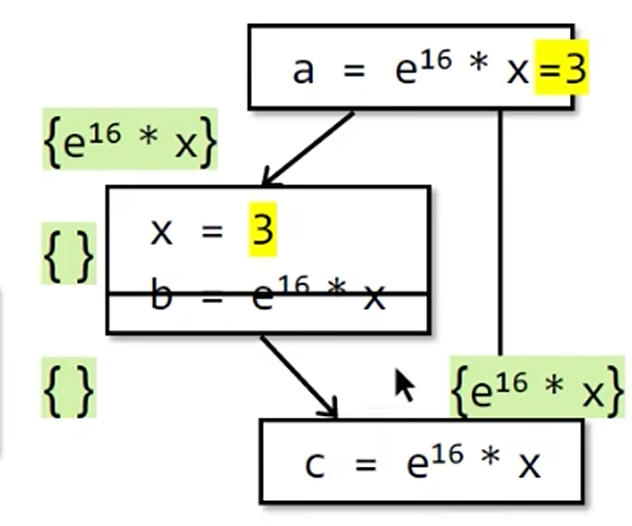

*An Example:*

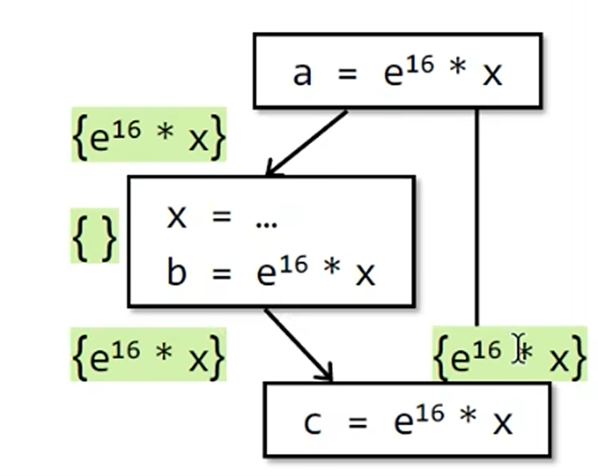

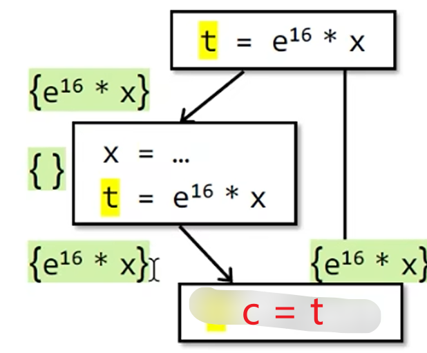

#### Algorithm of Available Expressions Analysis

**INPUT:** CFG ($kill_B$ and $gen_B$ computed for each basic block B)

**OUTPUT:** IN[B] and OUT[B] for each basic block B 

**METHOD:** 

```java
OUT[entry] = ⌀;

for (each basic block B\entry)
    OUT[B] = U; // 全集

while (changes to any OUT occur)
    for (each basic block B\entry) {
        // Control Flow
        IN[B] = ⋂ _ {P a predecessor of B} OUT[P]
        // Transfer Function
        OUT[B] = gen_B ⋃ (IN[B] - kill_B)
    }
```

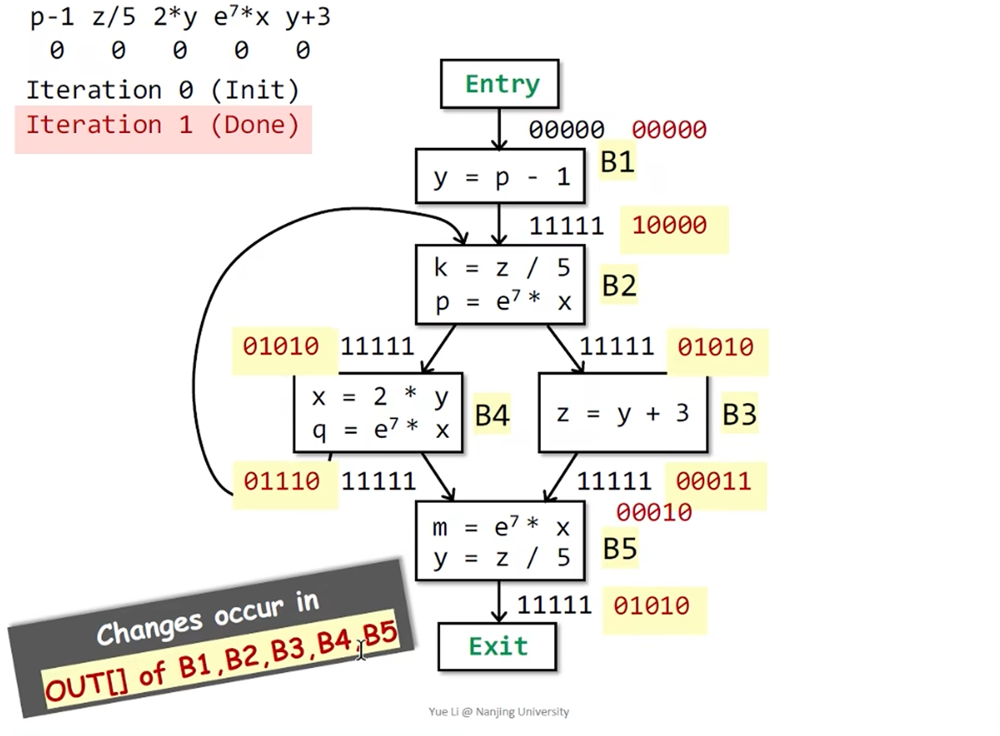

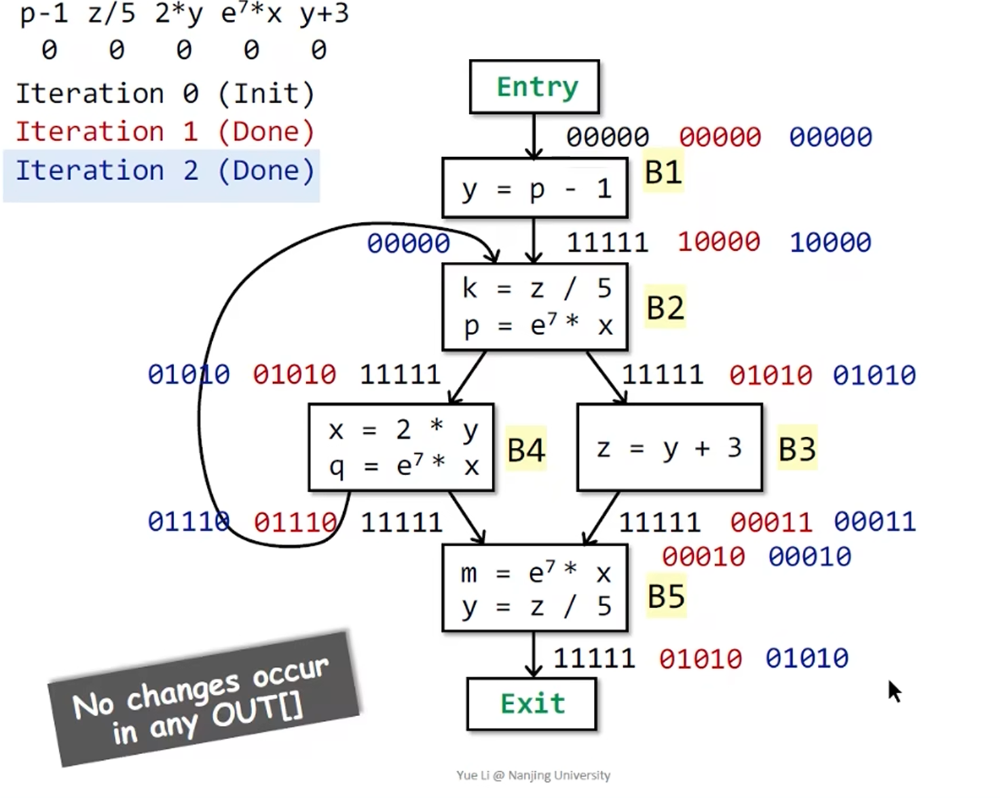

---

### Analysis Comparison (这个是需要记忆住的)


|                  | Reaching Definitions       | Live Variables             | Available Expressions      |
| -----            | ----                       | ----                       | ---                        |
| Domain           | Set of Definitions         | Set of Variables           | Set of Expressions         |
| Direction        | Forwards                   | Backwards                  | Forwards                   |
| May/Must         | May                        | May                        | Must                       |
| Boundary         | OUT[Entry]=Empty Set       | IN[Exit]=Empty Set         | OUT[Entry]=Empty Set       |
| Initialization   | OUT[B]=Empty Set           | IN[B]=Empty Set            | OUT[B]=Union Set           |
| Transfer Function| OUT[B]=gen_B⋃(IN[B]-kill_B)| IN[B]=use_B⋃(OUT[B]-def_B) | OUT[B]=gen_B⋃(IN[B]-kill_B)|
| Meet             | Union                      | Union                      | Intersection               |

## 问题

> 总体为上述的比较表格

- Understand the three data flow analyses:
  - reaching definitions
  - live variables 
  - available expressions
- Can tell the differences and similarities of the three data flow analyses
- Understand the iterative algorithm and can tell why it is able to terminate